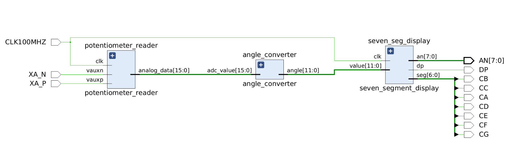

### Team members

* Šimon Navrátil (Team Leader)
* Petr Tomeček (responsible for ...)
* Zdeněk Pospíšil (responsible for ...)
* Matěj Nykl (responsible for ...)

### Abstract

This VHDL project runs on the Nexys A7-50T FPGA board. It reads the position of a potentiometer using the onboard Analog-to-Digital Converter (XADC) and displays the corresponding angle (0–180 degrees) on the 7-segment display. As the potentiometer is rotated, the display updates in real-time to reflect the current position in degrees.

## Hardware description of demo application

## Software description

### Component(s) simulations

## References

1. ...
2. ...
