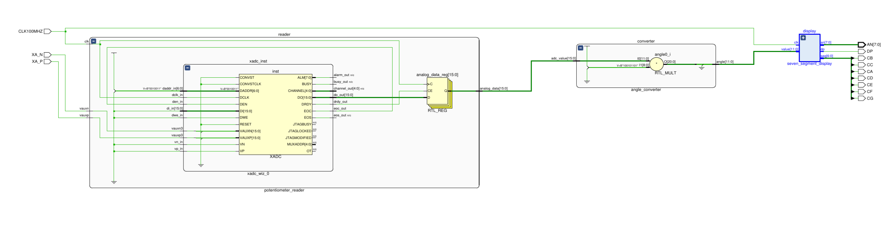
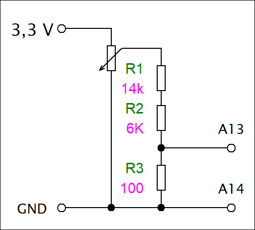

# Potentiometer Angle Display for Nexys A7-50T

## Team Members
- **Šimon Navrátil** - 7 segment implemetatation
- **Petr Tomeček** - Angle conversion algorithm + Bugfixes
- **Zdeněk Pospíšil** - Circuit integration
- **Matěj Nykl** - XADC interface implementation
## Abstract
This VHDL project implements a real-time potentiometer angle measurement system on the Nexys A7-50T FPGA board. The system:
- Reads analog voltage from a potentiometer using the Xilinx XADC (Analog-to-Digital Converter)
- Converts the reading to an angle value (0-300°)
- Displays the current angle on the 7-segment display
- Updates the display continuously as the potentiometer is rotated

## Board Overview: Nexys A7-50T

The **Nexys A7-50T** is an FPGA development board manufactured by Digilent, based on the **Xilinx Artix-7 XC7A50T** FPGA. It is designed for teaching and prototyping digital logic, embedded systems, and hardware design. Key features of the board include:

- **FPGA:** Xilinx Artix-7 XC7A50T-1CSG324C
- **Memory:** 512MB DDR3L RAM
- **USB-JTAG and USB-UART interfaces**
- **Peripherals:**
  - 16 user switches
  - 5 push buttons
  - 16 user LEDs
  - Four 7-segment displays
  - VGA output
  - Pmod connectors (for peripheral modules)
- **Clock:** 100 MHz onboard oscillator
- **Power supply via USB or external source**

    

 <fig caption> 
 Nexys A7-50T

## Hardware Implementation

### Block Diagram

### Key Components
1. **Nexys A7-50T FPGA Board**
2. **Potentiometer** connected to JXADC header (Pins A13/A14)
3. **7-segment display** for angle visualization
4. **Voltage Divider** for safe input voltage (0-1V)

### Pin Connections
| FPGA Pin | Signal      | Description               |
|----------|-------------|---------------------------|
| E3       | CLK100MHZ   | 100 MHz system clock      |
| A13      | XA_P        | Potentiometer + input     |
| A14      | XA_N        | Potentiometer - input     |
| T10-R10  | CA-CG       | 7-segment display segments|

## Software Implementation

### Main Components
1. **Potentiometer Reader** [(potentiometer_reader.vhd)](project/ADC.srcs/sources_1/new/potentiometer_reader.vhd)
   - Interfaces with XADC core
   - Reads 12-bit ADC values (0-4095)
   - Handles XADC configuration and data ready signals

2. **Angle Converter** [(angle_converter.vhd)](project/ADC.srcs/sources_1/new/angle_converter.vhd)
   - Converts raw ADC value to angle (0-300°)
   - Uses formula: `angle = (adc_value * 300) / 4095`
   - Provides 12-bit angle output

3. **7-Segment Display Controller** [(seven_segment_display.vhd)](project/ADC.srcs/sources_1/new/seven_segment_display.vhd)
   - Converts binary angle to BCD format
   - Implements multiplexed display refresh
   - Handles active-low segment driving

4. **Top Level** [(toplevel.vhd)](project/ADC.srcs/sources_1/new/toplevel.vhd)
   - Connects all components together
    
## Wiring diagram
### IMPORTANT WARNING !
Never exceed 1V on XA_P/XA_N inputs!
### Voltage divider
This circuit ensures safe analog voltage measurement via the XADC while protecting the FPGA from overvoltage

## Video of the project
[Video of the project on Youtube](https://youtu.be/ENF9i8tKyDE)

## References
1. Nexys A7 Reference Manual, Digilent Inc. [Link to the site](https://digilent.com/reference/programmable-logic/nexys-a7/reference-manual?srsltid=AfmBOor2PdgU8TxAPeHtZ3KEre21VycXjoJT34BDJdfFQY4jLllKyd2z)
2. Xilinx 7 Series FPGAs XADC User Guide (UG480) [Link to the site](https://docs.amd.com/r/en-US/ug480_7Series_XADC/7-Series-FPGAs-and-Zynq-7000-SoC-XADC-Dual-12-Bit-1-MSPS-Analog-to-Digital-Converter-User-Guide-UG480)
3. VHDL Programming by Example, Douglas Perry [Link to the site](http://ebook.pldworld.com/_eBook/FPGA%EF%BC%8FHDL/-Eng-/VHDL.%20Programming%20by%20Example.%204th%20Ed%20(Douglas%20Perry).pdf)

